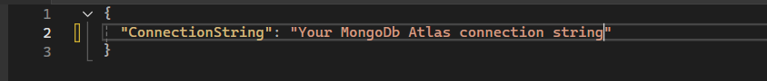
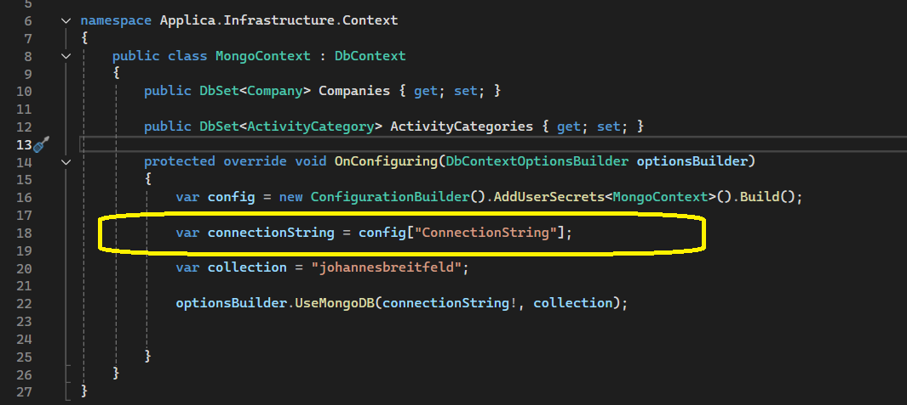

# Installation

- Clone this repository to your local machine.

- Add a user secret with your MongoDB Atlas connection string in Applica.infrastructure project.  

- Or you can just change the connection string in the code directly.  

### NOTE THAT THE APPLICATION WILL NOT RUN AS INTENDED IF YOU SET THE DATABASE UP AGAINST LOCALHOST.
